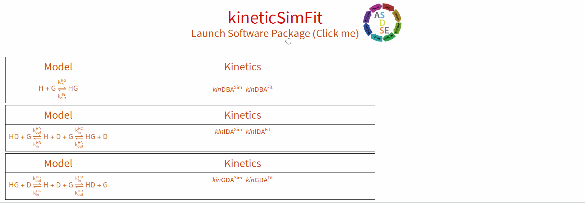
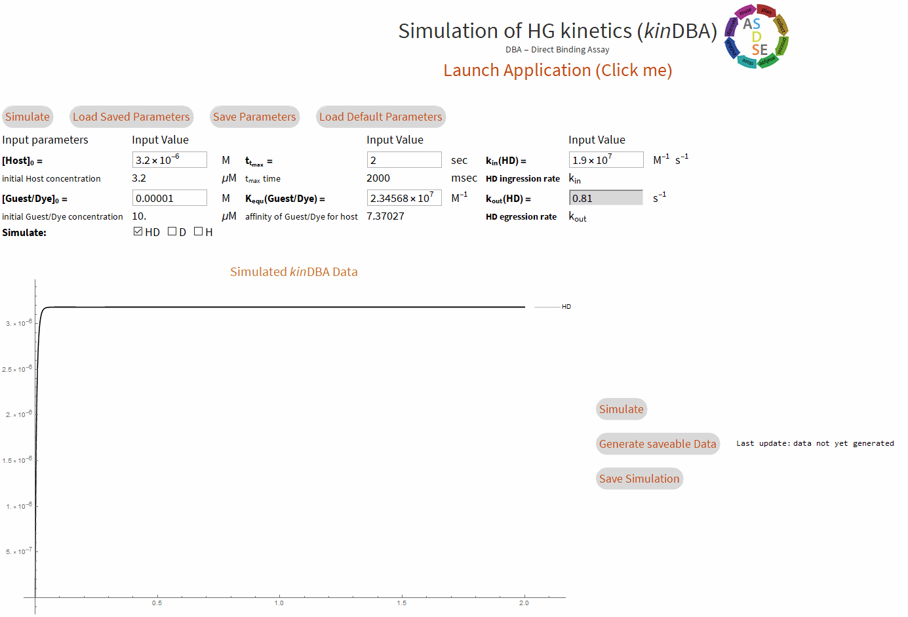
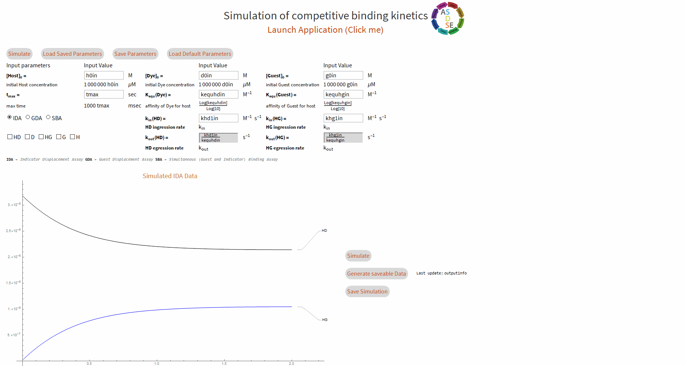
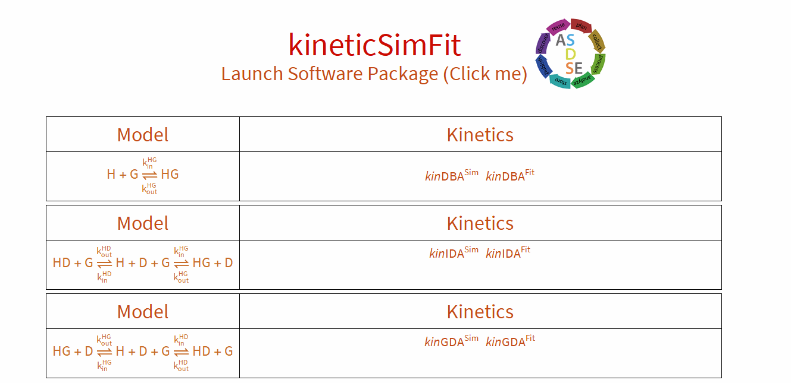

# kineticSimFit

GUI Simulation and fitting tools for kinetics of binding interactions, based on Mathematica.

## Prerequisites

Download and install Mathematica (11/12+) <https://www.wolfram.com/mathematica/>

## Contributions

We are happy for any contributions. ADSDE is the perfect platform for further development and deployment of scientific and educational software. Thus, you are free to fork and dev on your own, or branch and be part of the dev team. Please branch from master.

## How to use

### Download and Installation

1. Download the latest release <https://github.com/ASDSE/kineticsimfit/releases>
2. Unpack the zip
3. Open the file **kineticSimFit.nb** (double click)

### Getting started

1. click: **Launch Application**
2. Choose a program of the suite (click on it)
3. click: **Launch Application** in the opened GUI
4. click: **Simulate or Import/Update Data**

### Simulate and Export data (csv format)

1. Fill in the parameters of interest
2. click: **Simulate**
3. click: **Generate saveable Data**
4. click: save data
5. Choose a directory to Save

  #### Simulate a Direct-Binding Assay (*kin*DBA)

#### Simulate a Competitive-Binding Assay (*kin*GDA or *kin*IDA)

### Sample data

Sample data for DBA, IDA and GDA is provided in **/Fitting/Samples** (<https://github.com/ASDSE/kineticsimfit/tree/master/Fitting/Samples>), results can be found here https://doi.org/10.1039/D0CC03715J

Each sample data has a descriptive name and an info file with the same name providing a good guess. A fit leaving only the rate constant of interest unfixed will give the results presented in the paper.

Four data samples are provided for kinDBA, kinIDA, kinGDA and kinGDA/kinGDAPFO besides simulated sample datasets. All is given in self-descriptive filenames. The files need to be imported before anything can operate. The appropriate input values are either pre-loaded from the application, can be loaded with **Load parameters** or provided as info image. After filling the inputs typically it is enough to do:
1. adjust the time span
2. **Simulate**
3.  unfixing kin(HG), Signal-0 and Signal-HD
4. **Fit the data**
5. Note: Click **Simulate** again, since some signal parameters are not always automatically updated

**Note**: The paper displays the mean of at least (often more repetitions) triplicates of mixings, whereas the sample data provided here is only one part of these repetitions. Thus, the obtained fitting results might differ slightly from the reported ones.

### Import raw data (txt) and fit to a model

1. click: **Browse...** and choose file -> open
2. select appropriate import parameters (JASCO option recognizes meta data header and footer of the brands output) and click: **Import/Update Data**
3. adjust the values for concentrations, binding and rate constants (CBA) according to acquisition conditions
4. give a good guess for the rate constant of interest and the signal parameters
5. adjust the **red simulated curve** as close as possible to the real data (**blue dots**)
6. click: **Click here to Fit** (choose the fixation wisely)
7. results are presented at the end and can be saved

Tip: You may trim the data to limit the fitting range.

  #### Fit a Direct-Binding Assay (*kin*DBA)

#### Fit a Guest-Displacement Assay (*kin*GDA)

### Save parameters

In order to reduce frustration, one can save the filled parameters, to use them as a backup if the resulting fit with a lot of unfixed parameters is not well. **Note** The software package comes with pre-saved parameters for the provided real sample data which you can retrieve by simply clicking on **Load parameters**. Saving your custom parameters will overwrite these values but you can view in conditions in the samples folder.
